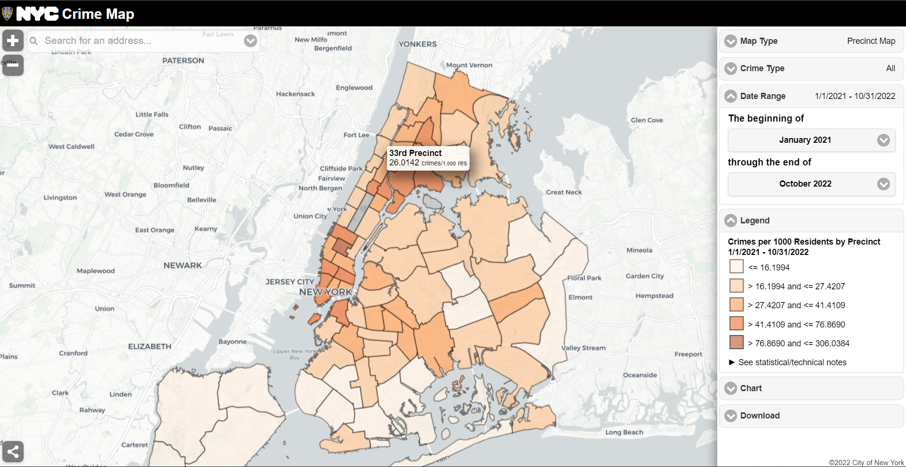

```{r setup, include=FALSE}
knitr::opts_chunk$set(echo = TRUE)
library(tidyverse)
library(maps)
library(gganimate)
library(gifski)
library(magick)
library(viridis)
library(RColorBrewer)
library(ggplot2)
library(cowplot)
library(readr)
library(dplyr)
library(tidyfst)
library(zoo)
library(plotly)
library(lubridate)
library(broom)
library(kableExtra)
library(gplots)
library(corrplot)
```

# Motivation 

Crime rates in New York City have been recorded since at least the 1800s. The highest crime totals were recorded in the late 1980s and early 1990s as the crack epidemic surged, and then declined continuously through the 2000s. During the 1990s, the New York City Police Department (NYPD) adopted CompStat and other strategies in a major effort to reduce crime.

It is the fact that all of our team members have heard crime alerts from NYPD frequently in the past year. Although we believe that New York City is one of the safest big cities in the United States according to the FBI, we have been so curious about the detailed information of historical crimes happened in the New York City, especially in the pattern where we are currently living.

Since in recent years the COVID-19 has brought huge effects to people's life, We are more interested in the changes of complaint each year from 2020 to 2021, especially in the Manhattan borough. In this project, we intended to explore the general information about complaint data in the past two years, and to figure out if COVID-19 influenced the rate or other attributes of crimes.

Thus, Our project aims to examine NYPD complaint data from January 2020 to December 2021 to understand the impact of COVID-19 on complaints (crimes) in Manhattan. 

*Reference: https://en.wikipedia.org/wiki/Crime_in_New_York_City*

# Related Work

(Related work: Anything that inspired you, such as a paper, a web site, or something we discussed in class.)



*Pictured resource: https://maps.nyc.gov/crime/*

Inspired by our regularly received crime alerts from Columbia University Department of Public Safety, when we mentioned the crime rate of NYC, all of our teammates showed great interest. When we googled it for more information, the NYC Crime Map gave us a shock on the actual number of crimes around us just from January 2021 to October 2022. 

After some initial exploring, we successfully found that resources about NYC crime and complaint data are sufficient and detailed. Based on the information we have gathered, we decided to conduct our analysis on the most recently published NYPD Compliant Data, which contained plenty of attributes correlated with each complaint of crime happened and recorded in the New York City.


# Initial Questions

Initially, we wanted to figure if the COVID-19 had any effects on the complaints occurred in Manhattan (i.e., if the compliant rate changed, etc.). In order to examine the changes on complaints and to correlate it with the COVID-19 pandemic, we decided to use the complete NYPD compliant data in year 2020 and 2021, which could represent the worst period and the recovery period of the pandemic in recent years. 

While we initiated the analyzing of our data, we found that despite the number of complaints, we have gathered more information such as the attributes of suspects and victims. Then we decided to do more exploration about what could we get through the data to make peers like us be safer.

Fortunately, the available data did allow us to explore what we cared about. Ultimately, we landed on two main categories of exploration:

1. **Descriptive Statistics:** 
*   What is the general distribution of all the complaints in two year (2020 and 2021)? 
*   When did the peak of complaints occurred? Where did most of complaints occurred? 
*   Was there any possible trend of compliant rate changes related with the COVID-19 pandemic? 
*   What were the most common characters of suspects and victims? What about the premises? 
*   Could we get any suggestions from the summary of complaints?

2. **Comparisons of complaints between 2020 vs 2021:** 
*   What assumption could we made from the results of descriptive statistics? 
*   What changes could we see from the comparisons of complaint frequencies between 2020 and 2021? 
*   What changes could we see from the comparisons of complaint distributions between 2020 and 2021? 
*   What about the locations of complaints in the two years? 
*   Did these changes support our assumption or not? 


# Data

The raw data we used was from **NYC OpenData: NYPD Complaint Data Historic**: https://data.cityofnewyork.us/Public-Safety/NYPD-Complaint-Data-Historic/qgea-i56i

The NYPD Complaint Data is public and readily available. The data includes all valid felony, misdemeanor, and violation crimes reported to the New York City Police Department (NYPD) from 2006 to the last updated date, which was June 9, 2022 when we started our project.

The first and the most difficult challenge we have encountered was that the original data was too large to be downloaded and analyzed - the size was over 2 GB! It took us more than half an hour to obtain the whole raw data, which contained 35 variables and more than 7 million observations.

Then the first step to handle such a huge data set was to tidy out the part that we wanted to focus on.

```{r eval=FALSE}
nypd_complaint_data = 
  read_csv("./data/NYPD_Complaint_Data_Historic.csv") %>%
  janitor::clean_names() %>%
  drop_na(cmplnt_to_dt,cmplnt_to_tm) %>%
  separate(cmplnt_fr_dt, into = c("month", "day", "year")) %>%
  mutate(year = as.numeric(year),month = as.numeric(month), day = as.numeric(day)) %>%
  filter(year >= 2020)

write_csv(nypd_complaint_data, "./data/2020_nypd_complaint_data.csv")

nypd_complaint_2020_data = 
  read_csv("./data/nypd_complaint_data.csv") %>%
  filter(year == "2020", boro_nm == "MANHATTAN")

nypd_complaint_2021_data = 
  read_csv("./data/nypd_complaint_data.csv") %>%
  filter(year == "2021", boro_nm == "MANHATTAN")

nypd_complaint_two_year_data = 
  read_csv("./data/nypd_complaint_data.csv") %>%
  filter(year %in% c("2020", "2021"), boro_nm == "MANHATTAN")

write_csv(nypd_complaint_2020_data, "./data/nypd_complaint_2020_data.csv")

write_csv(nypd_complaint_2021_data, "./data/nypd_complaint_2021_data.csv")

write_csv(nypd_complaint_two_year_data, "./data/nypd_complaint_two_year_data.csv")
```

*Since the original data was too large to be uploaded online, we only kept it in our local repository.* After the initial cleaning of data, we made the following changes:

*   clean all the variables' name to be tidy enough to read, **drop those complaint records without exact ending date or time of occurrence**
*   separate the **exact date of occurrence for the reported event** into **month, day, year** for further analysis
*   keep only complaints occurred and recorded in year **2020** and **2021** (i.e., closely related with COVID-19 pandemic)
*   choose the borough of **Manhattan** as our study of interest (i.e., strict the pattern to where we live)
*   build new data frames from the resulted data and name as **nypd_complaint_2020_data**, **nypd_complaint_2021_data**, **nypd_complaint_two_year_data** for further analysis

```{r message=FALSE, warning=FALSE}
nypd_complaint_2020_data = 
  read_csv("./data/nypd_complaint_2020_data.csv")

nypd_complaint_2021_data = 
  read_csv("./data/nypd_complaint_2021_data.csv")

nypd_complaint_two_year_data = 
  read_csv("./data/nypd_complaint_two_year_data.csv")
```

After we obtained the three data sets above, **nypd_complaint_2020_data** had 88,484 observations of complaint data and **nypd_complaint_2021_data** had 101,990 observations of complaint data. **nypd_complaint_two_year_data** was the combination of data from both 2020 and 2021, which had 190,474 observations. Here were some of the important variables within all of the three data sets:

*   `cmplnt_num`: Randomly generated persistent ID for each complaint
*   `month`: Exact month of occurrence for the reported event
*   `day`: Exact day of occurrence for the reported event
*   `year`: Exact year of occurrence for the reported event
*   `addr_pct_cd`: The precinct in which the incident occurred
*   `ky_cd`: Three digit offense classification code
*   `ofns_desc`: Description of offense corresponding with key code
*   `boro_nm`: The name of the borough in which the incident occurred
*   `prem_typ_desc`: Specific description of premises; grocery store, residence, street, etc.
*   `susp_age_group`: Suspect’s Age Group
*   `susp_race`: Suspect’s Race Description
*   `susp_sex`: Suspect’s Sex Description
*   `latitude`: Midblock Latitude coordinate for Global Coordinate System, WGS 1984, decimal degrees (EPSG 4326)
*   `longitude`: Midblock Longitude coordinate for Global Coordinate System, WGS 1984, decimal degrees (EPSG 4326)
*   `vic_age_group`: Victim’s Age Group
*   `vic_race`: Victim’s Race Description
*   `vic_sex`: Victim’s Sex Description


# Exploratory Analysis

### Descriptive Statistics:

AS an overview, here were the descriptive statistics about our data.

**General distribution of complaints:** First of all, we made a plot to show the general distribution of all complaints in 2020 and 2021. Based on the information we got, we suggested that the average daily complaint volume in Manhattan in 2021 seemed exceed that in 2020 since about February, and continued to the end of 2021. Moreover, the complaint volume peaked in 2021 especially in May. Later then, we started to make the assumption that the development of COVID-19 did have great influence on the number of complaints in Manhattan.

```{r message=FALSE, warning=FALSE}
complaint_df = nypd_complaint_two_year_data %>% 
  janitor::clean_names() %>% 
  filter(
    !susp_age_group == c("UNKNNOWN"),
     susp_age_group == c("<18", "18-24","25-44","45-64","65+"),
    vic_age_group == c("<18", "18-24","25-44","45-64","65+")
  ) %>% 
  mutate(
    susp_age_group = ifelse(susp_age_group %in% c("<18", "18-24", "25-44", "45-64", "65+"), susp_age_group, "UNKNOWN"),
    vic_age_group = ifelse(vic_age_group %in% c("<18", "18-24", "25-44", "45-64", "65+"), vic_age_group, "UNKNOWN"),
    vic_race = ifelse(is.na(vic_race), "UNKNOWN", vic_race),
    vic_sex = ifelse(vic_sex %in% c("F", "M"), vic_sex, "U"),
    susp_sex = ifelse(susp_sex %in% c("F", "M"), susp_sex, "U"),
    susp_age_group = factor(susp_age_group),
    susp_race = factor(susp_race),
    susp_sex = factor(susp_sex),
    vic_age_group = factor(vic_age_group),
    vic_race = factor(vic_race),
    vic_sex = factor(vic_sex),
    boro_nm = factor(boro_nm)
  ) 
complaint_1 = 
  select(complaint_df, c("month", "year", "day", "susp_age_group" , "boro_nm" , "loc_of_occur_desc", "susp_sex", "vic_age_group", "vic_age_group", "vic_sex")) 
complaint_1 = complaint_1 %>% 
  mutate(
    month = as.numeric(month),
    month = str_pad(month,width = 2,side = 'left',pad = '0'),
    day = str_pad(day,width = 2,side = 'left',pad = '0'),
    month_day = str_c(month, "-", day),
    month_day = factor(month_day)
    )
complaint_1 = complaint_1 <- cbind(complaint_1[10],complaint_1[,1:9])
complaint_1 = arrange_dt(complaint_1,dt)
```

```{r message=FALSE, warning=FALSE}
complaint_1 %>% 
  group_by(month_day, year) %>% 
  summarize(obs = n()) %>% 
  ggplot(aes(x = month_day, y = obs, group = year, color = as.factor(year))) +
  geom_line() + 
  geom_smooth(se = FALSE) +
  labs(title = "Number of Complaint in 2020 and 2021", x = "Complaint Date", y = "Number of Complaint", col = "Year") + 
  theme(axis.text.x = element_text(angle = 90, vjust = 0.5, hjust = 1, color = rep(c("black", rep("transparent", each = 15))))) +
  theme(plot.title = element_text(hjust = 0.5))
```

**Characteristics of suspects:** In order to get more information about the most common suspects recorded in the NYPD complaint data, We analyzed the distribution of major Characteristics (gender and age group) of all the suspects in both 2020 and 2021. Actually the most suspects were males aged between 25-44. This gave us the suggestion that if we are alone and feel in case of danger, better beware of men aged 25-40 around you.

```{r message=FALSE, warning=FALSE}
complaint_1 %>% 
  group_by(susp_age_group, susp_sex) %>% 
  summarize(obs = n()) %>% 
  
  ggplot(aes(x = as.factor(susp_age_group), y = obs, group = susp_sex, color = as.factor(susp_sex))) +
  geom_line() + 
  geom_smooth() +
  labs(title = "Number of complaint(suspects) in 2020 and 2021 by Age Group and Gender", x = "Age group", y = "Number of Complaint", col = "Gender") 
```

**Characteristics of victims:** In order to get more information about the most common victims recorded in the NYPD complaint data, We analyzed the distribution of major characteristics (gender and age group) of all the victims in both 2020 and 2021. As we could see from the results, the number of female victims in 2020 and 2021 was much higher than male victims in Manhattan, and the victim age group was heavily concentrated in between 25-44. If you are a young female, please pay more attention to your personal safety when you are outside alone, even in Manhattan.

```{r message=FALSE, warning=FALSE}
complaint_1 %>% 
  group_by(vic_age_group, vic_sex) %>% 
  summarize(obs = n()) %>% 
  ggplot(aes(x = vic_age_group, y = obs, group = vic_sex, color = vic_sex)) +
  geom_line() + 
  geom_smooth() +
  labs(title = "Number of complaint(victims) in 2020 and 2021 by Age Group and Gender", x = "Age group", y = "Number of Complaint", col = "Gender") 
```

**General distribution of premises:** To figure out which type of premises was/were the most dangerous for a complaint to happen, we plotted the distribution of all the prime suspected victim sites in Manhattan in both 2020 and 2021.The results was the safest location one might considered as - home! The result was actually reasonable if we thought about the background of COVID-19 pandemic at the beginning. We may guess that in the worst period of COVID-19 outbreaks most people had been blocked in home instead of going out, which led to a higher frequency of crimes occurred at home.

```{r message=FALSE, warning=FALSE}
complaint_df %>% 
  group_by(prem_typ_desc) %>% 
  count(prem_typ_desc) %>% 
  filter(n > 2) %>% 
  mutate(prem_typ_desc = fct_reorder(prem_typ_desc, n)) %>% 
  ggplot(aes(x = prem_typ_desc, y = n )) + 
  geom_point(aes(color = n),alpha = 0.5) + 
  geom_smooth( se = FALSE) +
  labs(title = "Prime suspected victim site in 2020 and 2021",x = "Location ", y = "Frequency") +
  theme(axis.text.x = element_text(angle = 60, hjust = 1)) +
  theme(plot.title = element_text(hjust = 0.5))
```


### Comparisons of complaints in Manhattan between 2020 vs 2021:

As part of our research body, we conducted several comparisons between the two years based on our data sets.

**Number of monthly Complaints in Manhattan 2020 vs 2021:** Since 2020 was the year that COVID-19 had almost the most breakouts which restricted people's social activities, while in 2021 people were more free from the negative effect from COVID-19, there would be corresponding changes on the complaint and crime rates. According to the comparison we made based on the number of complaints in 2020 and 2021, we confirmed our assumption. The number of complaints in Manhattan of 2021 is more than in 2020 in most months. One of the reasonable explanations may be the **the effect of COVID-19 home isolation policy**, which caused a declined number of people in social activities and resulted in the decreasing of number of complaints in 2020 compared to 2021.

```{r message=FALSE, warning=FALSE}
complaint_plot = read_csv("./data/nypd_complaint_two_year_data.csv") %>% 
  group_by(month,year) %>% 
  summarize(obs = n()) %>% 
  ggplot(aes(x = month, y = obs, group = year, color = as.factor(year))) + 
  geom_point() +
  geom_line() +
  labs(x = "Month", y = "Number of Complaints in Manhattan", col = "Year") +
  ggtitle("Number of Complaints in Manhattan 2020 vs 2021") +
  theme(axis.text.x = element_text(angle = 60, vjust = 0.2, hjust = 0.5)) +
  scale_x_continuous(
    breaks = c(1,2,3,4,5,6,7,8,9,10,11,12), 
    labels = c("Jan","Feb","Mar","Apr","May","Jun","Jul","Aug","Sep","Oct","Nov","Dec")) +
  viridis::scale_color_viridis(discrete = T)

complaint_plot 
```

**Number of Complaints by Types 2020 vs 2021:** In order to know more details about the types of complaints while making comparisons between year 2020 and 2021, we specified the number of each types of compliant and selected those types with a number over **1000** in both years as effective types of complaint in our comparison. The resulted types were classified by the NYPD as variable `ofns_desc` in the data set and listed as following:

*   PETIT LARCENY
*   HARRASSMENT
*   GRAND LARCENY
*   ASSAULT 3 & RELATED OFFENSES
*   CRIMINAL MISCHIEF & RELATED OF
*   FELONY ASSAULT
*   BURGLARY
*   ROBBERY
*   OFF. AGNST PUB ORD SENSBLTY &
*   DANGEROUS DRUGS
*   MISCELLANEOUS PENAL LAW
*   OFFENSES AGAINST PUBLIC ADMINI
*   GRAND LARCENY OF MOTOR VEHICLE

AS a result, that the numbers of complaints in 2021 for almost all types were larger than in 2020. However, when we conducted further comparisons on the proportion of different types of complaints in 2020 and 2021, the proportion of each type didn't change a lot from 2020 to 2021. In both two years, **PETIT LARCENY**, **HARRASSMENT** and **GRAND LARCENY** were the main types of complaints.

```{r message=FALSE, warning=FALSE}
complaint_type_plot = read_csv("./data/nypd_complaint_two_year_data.csv")  %>% 
  group_by(ofns_desc, year) %>% 
  summarise(obs = n()) %>% 
  filter(obs > 1000) %>% 
  filter(ofns_desc != "SEX CRIMES") %>% 
  filter(ofns_desc != "VEHICLE AND TRAFFIC LAWS") %>% 
  arrange(desc(obs)) %>% 
  ggplot(aes(x = ofns_desc, y = obs, fill = as.factor(year))) +
  geom_bar(stat = "identity",position = position_dodge()) +
  geom_text(aes(label = obs), vjust = 1.6, color = "white",
            position = position_dodge(0.9), size = 1.5) +
  xlab("Types pf Complaints") + ylab("Number of Complaints") + 
  ggtitle("Number of Complaints by Types 2020 vs 2021") + 
  theme(axis.text.x = element_text(angle = 60, vjust = 1, hjust = 1, size = 5)) +
  scale_fill_discrete(name = "Year") +
  viridis::scale_color_viridis(discrete = T)

complaint_type_plot
```

```{r message=FALSE, warning=FALSE}
type_pie_2020 = read_csv("./data/nypd_complaint_2020_data.csv")  %>% 
  group_by(ofns_desc) %>% 
  summarise(obs = n()) %>% 
  filter(obs > 1000) %>% 
  arrange(desc(obs)) %>% 
  mutate(prop = round(obs/sum(obs)*100,2)) %>% 
  ggplot(aes(x = "", y = prop, fill = ofns_desc)) +
  geom_bar(stat = "identity",width = 1, color = "white")  +
  coord_polar("y", start = 0) +
  geom_text(aes(label = paste0(prop, "%")), position = position_stack(vjust = 0.5), size = 2) +
  labs(x = NULL, y = NULL, title = "2020")  +  
  theme(legend.title = element_text(size = 10),legend.key.size = unit(0.5, 'cm')) +
  theme(plot.margin = margin(0.1,0.1,0.1,0.1, "cm")) +
  scale_fill_discrete(name = "Complaint Type") +
  viridis::scale_color_viridis(discrete = F)

type_pie_2021 = read_csv("./data/nypd_complaint_2021_data.csv")  %>% 
  group_by(ofns_desc) %>% 
  summarise(obs = n()) %>% 
  filter(obs > 1000) %>% 
  arrange(desc(obs)) %>% 
  filter(ofns_desc != "SEX CRIMES") %>% 
  filter(ofns_desc != "VEHICLE AND TRAFFIC LAWS") %>% 
  mutate(prop = round(obs/sum(obs)*100,2)) %>% 
  ggplot(aes(x = "", y = prop, fill = ofns_desc)) +
  geom_bar(stat = "identity",width = 1, color = "white") +
  theme(legend.title = element_text(size = 10),legend.key.size = unit(0.5, 'cm')) +
  theme(plot.margin = margin(0.1,0.1,0.1,0.1, "cm")) +
  coord_polar("y", start = 0) +
  geom_text(aes(label = paste0(prop, "%")), position = position_stack(vjust = 0.5), size = 2) +
  labs(x = NULL, y = NULL, title = "2021", fill = "Complaint Type" ) +
  viridis::scale_color_viridis(discrete = F)

par(mfrow = c(2,1))
type_pie_2020
type_pie_2021
```

**Complaint Locations in Manhattan 2020 vs 2021:** After analyzing the number and types of complaints, we became more interested in whether there is any difference in the distributions of complaint's specific locations in Manhattan between 2020 and 2021. If complaints occurred in 2020 had a larger density than in 2021? Which patterns were the most complaints occurred in each year? Was there any correlation between the distribution of complaints and the COVID-19 status in 2020 and 2021?

We took locations that had **10** complaints and above as the effective locations and made comparisons based on monthly complaints in Manhattan in 2020 and 2021. Based on the results, we found that the overall **complaint density of 2021 is larger** than that in the 2020, especially in April, May and June. This had confirmed our assumption that the recovery of social activities could bring larger density of complaints. Meanwhile, we figured out that the most complaints repeated **in the upper city** of Manhattan in both of the two years, which meant that the upper city might be less safer compared with other areas in Manhattan.

```{r message=FALSE, warning=FALSE}
complaint_data = read_csv("./data/nypd_complaint_two_year_data.csv") %>% 
  mutate(month = as.integer(month)) %>% 
  as_tibble(map_data("state")) 


complaint_month_2020 = read_csv("./data/nypd_complaint_2020_data.csv") %>% 
  mutate(month = as.integer(month)) %>% 
  group_by(month, latitude, longitude) %>% 
  summarise(obs = n()) %>% 
  filter(obs >= 10)

complaint_month_2021 = read_csv("./data/nypd_complaint_2021_data.csv") %>% 
  mutate(month = as.integer(month)) %>% 
  group_by(month, latitude, longitude) %>% 
  summarise(obs = n()) %>% 
  filter(obs >= 10)
  
map_2020 = 
  ggplot() +
  geom_point(data = complaint_month_2020, aes(x = longitude, y = latitude, size = 0.01, color = obs), alpha = 0.5) +
  scale_size(range = c(1,8)) +
  transition_time(month) +
    labs(
    title = "2020 Month: {frame_time}", 
    color = "Complaints",
    x = "Longitude",
    y = "Latitude") +
  enter_grow() +
  exit_shrink() +
  ease_aes("sine-in-out") +
  coord_cartesian(ylim = c(40.68, 40.87), xlim = c(-74.02, -73.925)) +
   viridis::scale_color_viridis()

map_2021 = 
  ggplot() +
  geom_point(data = complaint_month_2021, aes(x = longitude, y = latitude, size = 0.01, color = obs), alpha = 0.5) +
  scale_size(range = c(1,8)) +
  transition_time(month) +
    labs(
    title = "2021 Month: {frame_time}", 
    color = "complaints",
    x = "Longitude",
    y = "Latitude") +
  theme(legend.position = "none") +
  enter_grow() +
  exit_shrink() +
  ease_aes("sine-in-out") +
  coord_cartesian(ylim = c(40.68, 40.87), xlim = c(-74.02, -73.925)) +
   viridis::scale_color_viridis()


map_gif_2020 = image_read(animate(map_2020, duration = 12, fps = 1, width = 400, height = 400))
map_gif_2021 = image_read(animate(map_2021, duration = 12, fps = 1, width = 400, height = 400))

new_month_gif = image_append(c(map_gif_2020[1], map_gif_2021[1]))
for (i in 2:12) {
  combined_month = image_append(c(map_gif_2020[i], map_gif_2021[i]))
  new_month_gif = c(new_month_gif, combined_month)
}

new_month_gif
```


# Additional Analysis

**Test Independence between Victim Sex and Suspect Sex：**

In order to enhance the confidence of our "safety suggestions", we used the chi-square test to explore whether there is a relationship between the victim sex and suspect sex:

Hypotheses:

*   Ho: sex of victim and sex of suspect are independent
* Ha: sex of victim and sex of suspect are not independent 

As the results, the p-value of chi-square test was much smaller than alpha = 0.05, we **reject H0**. We draw the conclusion that sex of victim and sex of suspect are *not independent* at 0.05 significance level, which might indicate that male suspects and female victims had the higher likelihood to be correlated with each other.

```{r message=FALSE, warning=FALSE}
sex_data = read_csv("./data/nypd_complaint_two_year_data.csv") %>% 
  select(vic_sex, susp_sex) %>% 
  na.omit() 

vF_sF = sex_data %>% 
  filter(vic_sex == "F") %>% 
  filter(susp_sex == "F") %>% 
  count()
  
vM_sF = sex_data %>% 
  filter(vic_sex == "M") %>% 
  filter(susp_sex == "F") %>% 
  count()
  
vF_sM = sex_data %>% 
  filter(vic_sex == "F") %>% 
  filter(susp_sex == "M") %>% 
  count()
  
vM_sM = sex_data %>% 
  filter(vic_sex == "M") %>% 
  filter(susp_sex == "M") %>% 
  count()

sex = matrix(c(9850,6199,29030, 26307), ncol = 2, byrow = T) 
colnames(sex) = c("Female","Male")
rownames(sex) = c("Female","Male")
sex %>% 
  kbl(caption = "Horizontal: Victim, Vertical: Suspect", ) %>% 
  kable_classic(full_width = F, html_font = "Cambria")

test_sex = matrix(c(9850,6199,29030, 26307), ncol = 2, byrow = T) 

chisq.test(test_sex)
```

**Test Independence between Victim Race and Suspect Race：**

We also used the chi-square test to explore whether there is a relationship between the victim race and suspect race:

Hypotheses:

*   Ho: race of victim and race of suspect are independent
*   Ha: race of victim and race of suspect are not independent

As the results, the p-value of chi-square test was much smaller than alpha = 0.05, we **reject H0**. We draw the conclusion that race of victim and race of suspect are *not independent* at 0.05 significance level, which might indicate that young suspects and young victims had the higher likelihood to be correlated with each other.

```{r message=FALSE, warning=FALSE}
race_data = read_csv("./data/nypd_complaint_two_year_data.csv") %>% 
  group_by(vic_race, susp_race) %>% 
  summarise(obs = n()) %>% 
  na.omit() %>% 
  pivot_wider(names_from = vic_race, values_from = obs)

table_race = race_data %>% 
  as.matrix() %>% 
  kbl(caption = "Victim Race Corresponding to Suspect Race", align = "c") %>% 
  kable_classic(full_width = F, html_font = "Cambria")

table_race

matrix_race =  as.matrix(race_data) %>% 
  as.integer() %>% 
  na.omit()

chisq.test(matrix_race)
```


# Discussion

The main goal of our project was to examine the potential influence brought by the COVID-19 pandemic to the complaint data in Manhattan. Our work showed that there did exist a relationship between the development of COVID-19 and the changes in complaints in Manhattan of from 2020 to 2021. 

Initially, we started to make the assumption that the development of COVID-19 did have great influence on the number of complaints in Manhattan after we saw the general distribution of all complaints in 2020 and 2021. Then the comparison we made based on the number of complaints in 2020 and 2021 helped us confirmed our assumption. To correlate it with the reality, we considered that one of the reasonable explanations may be the **the effect of COVID-19 home isolation policy**, which declined the number of people in social activities and resulted in the decreasing of number of complaints in 2020 compared to 2021. The result from premise distributions made us to be more convincing. Since a higher frequency of crimes occurred at home would be reasonable if we remembered that in the worst period of COVID-19 outbreaks most people had been blocked in home instead of going out. Meanwhile, we found that the overall **complaint density of 2021 was larger** than that in the 2020. This had also supported our assumption that the recovery of social activities could bring larger density of complaints.

However, when we conducted further comparisons on the proportion of different types of complaints in 2020 and 2021, the proportion of each type didn't change a lot from 2020 to 2021. we also figured out that the most complaints repeated **in the upper city** of Manhattan in both of the two years, which meant no significant differences in the patterns where compliant occurred. These evidence might suggest that although the COVID-19 pandemic had effects on the overall complaints in Manhattan, the effect was not significant enough to change more detailed attributes of complaints.

In addition, we also made discoveries about the tips on how to improve personal safety from our analysis. The results we have derived from data indicated that if we are alone and feel in case of danger, we would better beware of men aged about 25-40 around us, who could most likely to be the potential suspect. Besides, for young girls who prefers to stay alone without protection, please pay more attention to your personal safety since you have a higher possibility to be the potential victim even in a safety city like NYC.